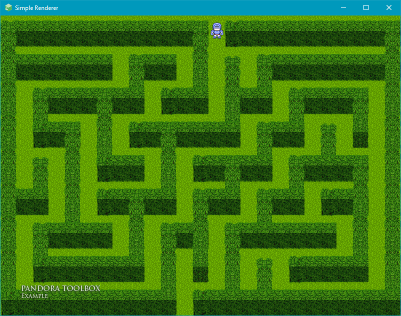
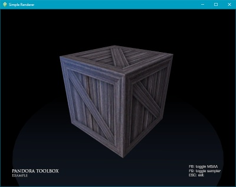

# 

 
  

**Pandora Toolbox** is a collection of portable C++ libraries useful to create **video/real-time projects**: video processing, video games, emulators, simple AI, screensavers...
The code is meant to be highly efficient and easy to use, while remaining lightweight and highly customizable.
Libraries (video/io/hardware...) can be included separately.

> [Features](./FEATURES.md) - | - [Cmake options](#cmake-options) - | - [Examples &amp; tutorials](./_examples/README.md) - | - [Changelog](./CHANGELOG.md) - | - [Issue reporting &amp; contribution](./CONTRIBUTING.md)

**Feature overview:**
* Window, renderer, message box, input, filters...
* Display monitor, gamepad, CPU spec reader...
* Timers, stopwatch, ordered lock, spin-lock, semaphore...
* Fixed max size vector/string, circular queue, endianness...
* Design patterns, search/sort algorithms, math/string utils...
* File utils, UTF-8/UTF-16 encoders, ini/json, logger, location finder...
* See [detailed list of features and compatibility](./FEATURES.md).

## Build status

|  |           system            |  compilers  |  status  |
|--|-----------------------------|-------------|----------|
|  | Windows          |     |     |
|  | Linux/BSD (X11)             |             |     |
|  | Mac OS                      |  |  |
|  | Linux (Wayland)   |   |  |

---

## Development

### Building project with Cmake

This project can be opened with any IDE that can natively handle Cmake files, or can be generated with Cmake. Some scripts are available to automatically generate the project for common IDEs ("_scripts" directory).
A few options can be used to build the solution when calling Cmake (or in the CMake settings of the IDE).

Using Cmake: \
**cmake -S [source_dir] -G [generator_name] -A [arch] -B [build_dir] -D[option_name]=[option_value]**

Examples:
> * cmake -S . -G "Visual Studio 16 2019" -A x64 -B _build -DCWORK_TESTS=OFF
> * cmake -S . -G "Unix Makefiles" -B _build -DCWORK_DOCS=ON
> * cmake -S . -G "MinGW Makefiles" -B _build -DCMAKE_C_COMPILER=gcc.exe -DCMAKE_CXX_COMPILER=g++.exe -DCMAKE_MAKE_PROGRAM=mingw32-make.exe

### Cmake options

|    Option    |    Name    |    Value(s)    |    Available for...    |
|--------------|------------|----------------|------------------------|
| Retro-compatibility with older C++ revisions (ex: C++14). *Default: "17" if supported, otherwise "14"*   | CWORK_CPP_REVISION  | "20" "17" "14"  | all C++17-compliant compilers  |
| Build separate symbol files, for debuggers such as GDB. *Default: OFF*         | CWORK_BUILD_SYMBOL_FILES   | ON OFF     | all systems                   |
| Include unit tests of each library in the built solution. *Default: ON*     | CWORK_TESTS                | ON OFF     | all desktop systems           |
| Generate code documentation (doxygen) for the built solution. *Default: OFF*   | CWORK_DOCS                 | ON OFF     | all desktop systems           |
| Include special tools related to projects in the built solution. *Default: ON* | CWORK_TOOLS                | ON OFF     | all systems                   |
| Generate debugging headers to allow code coverage. *Default: OFF*              | CWORK_COVERAGE             | ON OFF     | only linux/unix systems       |
| Minimum Windows version support (7/8.1/10.RS2). *Default: "8" on Win8.1/10+, otherwise "7"*       | CWORK_WINDOWS_VERSION  | "10" "8" "7"  | only windows systems   |
| Use Linux Wayland display server (instead of X.org). *Default: OFF*            | CWORK_LINUX_WAYLAND        | ON OFF     | only linux systems            |
| Enable Direct3D 11 features. *Default: ON if MSVC/clang-cl compiler*           | CWORK_VIDEO_D3D11          | ON OFF     | only windows systems (MSVC/LLVM required)  |
| Maximum Direct3D 11 feature level (11.0 - 11.4). *Default: "114" on Win8.1/10+, otherwise "110"*  | CWORK_D3D11_VERSION  | "114" "113" "111" "110"  | only windows systems (MSVC/LLVM required)  |
| Enable Vulkan features. *Default: ON if Vulkan SDK is installed*               | CWORK_VIDEO_VULKAN         | ON OFF     | all systems (environment variable *VULKAN_SDK* required)  |
| Enable OpenGL 4 features. *Default: OFF*                                       | CWORK_VIDEO_OPENGL4        | ON OFF     | all desktop systems           |
| Maximum OpenGL 4 feature level. *Default: "45" (or "41" on Mac OS)*            | CWORK_OPENGL4_VERSION      | "46" "45" "43" "41"  | all desktop systems |
| Allow shader compilation at runtime (D3D/Vulkan) *Default: ON*                 | CWORK_SHADER_COMPILERS     | ON OFF     | all desktop systems           |
| Disable geometry shader stage to reduce overhead (if not used) *Default: OFF* | CWORK_GEOM_STAGE_OFF     | ON OFF     | all systems                   |
| Disable tessellation stage to reduce overhead (if not used) *Default: OFF*  | CWORK_TESS_STAGE_OFF       | ON OFF | all systems                   |
