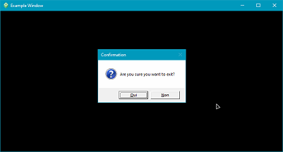

> [Features](../../FEATURES.md) - | - [Cmake options](../../README.md#cmake-options) - | - [Examples &amp; tutorials](../README.md) - | - [Changelog](../../CHANGELOG.md) - | - [Issue reporting &amp; contribution](../../CONTRIBUTING.md)

# Example 1 - Basic window

The purpose of this tutorial is to learn the basics about the Pandora Toolbox.
It will help getting familiar with how the libraries work, how to use the documentation, 
and how to organize projects with CWork (the custom CMake framework used by the Toolbox).

The tutorial will explain how to create a resizable window (with homothety constraints).
It will also cover the basics about the window event system, modal message-boxes, 
as well as the customization of window icons and mouse cursors.



* [Setting up the project](#setting-up-the-project)
    * [Project structure and resources](#project-structure-and-resources)
    * [CMake project description](#cmake-project-description)
    * [Creating CMake files with CWork](#creating-cmake-files-with-cwork)
    * [Dependencies and options](#dependencies-and-options)
    * [Project generation](#project-generation)
* [Basic window code](#basic-window-code)
    * [Entry point](#entry-point)
    * [Window creation](#window-creation)
    * [Window params](#window-params)
    * [Window resources](#window-resources)
    * [Event management](#event-management)

---

## Setting up the project

### Project structure and resources

Before writing any code, it's important to have a clear organization of the source files and resources.
To make things easier, this tutorial will only require a single source file (*'window_main.cpp'*), 
a CMake project description, and a few resource files.

Here's a typical project organization tree:
|  file/directory  |                                          content                                              |
|------------------|-----------------------------------------------------------------------------------------------|
| CMakeLists.txt   | project infrastructure description. Used to generate the IDE project.                         |
| include          | source code headers (.h): no header file in this tutorial. This directory isn't necessary.    |
| src              | source code implementation (.cpp): contains the only source code file (*'window_main.cpp'*).  |
| resources        | image files: window icon + custom mouse cursor.                                               |

Let's create the project files:
* For the sake of simplicity, the tutorial project directory will be placed inside the pandora_toolbox sources.
  Create a new directory called *'basic_window'* in *'pandora_toolbox/_examples/'*.
  Note: this tutorial will also briefly explain how to do it the other way around
  (pandora_toolbox in a subdirectory of a parent project, for example in a *'_libs'* directory).
* Inside the new directory, create an empty *'CMakeLists.txt'* file and 2 subdirectories: *'src'* and *'resources'*.
* Inside the *'src'* subdirectory, create an empty *'window_main.cpp'* file.
* Copy the entire directories *'pandora_toolbox/_img/test_win32'* and *'pandora_toolbox/_img/test_common'*
  into the *'resources'* subdirectory.

### CMake project description

CMake is a cross-platform utility to create platform and compiler independant project descriptions.
These descriptions can be used to generate solutions/projects for pretty much any IDE (and even makefiles).
That means that most IDEs can be used for these tutorials.
On Windows, I'd recommend using Visual Studio with MSVC or clang-CL (MinGW has known compatibility issues with Win32 API, and doesn't support Direct3D).

Unfortunately, CMake description files can be quite complex to write, and some features are poorly documented.
That's why pandora_toolbox contains its own custom CMake framework (called *CWork*) to make things easier.

A typical CMake tree uses an organization similar to Visual Studio solutions and projects.
A main CMake file describes a solution, which is a group of several related projects with common properties.
Then, each project of the solution has its own CMake file, describing source files, dependencies and build options.

In this tutorial, the solution will only contain a single project. To simplify things,
the solution and the project will both be described in the same unique CMake file.

### Creating CMake files with CWork

The pandora_toolbox libraries are organized as a solution containing several libraries.
The CWork framework makes it easy to integrate them into your project as some sort
of sub-solution called *'custom libs'* (as opposed to *'internal libs'* for projects
of the same solution, and *'external libs'* for third-party dependencies).

Our CWork description will declare:
* a parent solution for the tutorial.
* a child project in the solution (*'basic_window'*).
* dependencies to pandora_toolbox libs as *'custom libs'*.
* a few options for pandora_toolbox libs.

#### CMake version and CWork framework

Open *'CMakeLists.txt'* with your favorite text editor (Notepad++, Sublime, VSCode...).
Before describing anything, CMake has to know which **version** it should use.
The CWork framework requires at least version 3.14, so let's use this version or higher.
Add the CMake setting `cmake_minimum_required` to the top of the file:
```cmake
cmake_minimum_required(VERSION 3.14)
```

The next step is to load the CWork framework, to avoid having to write tons of complex rules ourselves.
CWork is located in *'pandora_toolbox/_cmake/cwork.cmake'*.
This file is the one to include in *'CMakeLists.txt'*, just below the CMake version setting.

Since our project is located in *'pandora_toolbox/_examples/basic_window'*, 
the **relative path to CWork** is *'../../_cmake/cwork.cmake'*.
Set this path in a CMake variable:
```cmake
# --> set relative path to pandora_toolbox sources
#     (your project is in a sub-sub-directory, such as ./_examples/basic_window)
set(PANDORA_TOOLBOX_DIR "${CMAKE_CURRENT_SOURCE_DIR}/../..")
```

Note: if the project was organized the other way around (with pandora_toolbox in a subdirectory), 
the relative path would be different:
```cmake
# --> set relative path to pandora_toolbox sources
#     (your project is the parent directory of pandora_toolbox)
set(PANDORA_TOOLBOX_DIR "${CMAKE_CURRENT_SOURCE_DIR}/_libs/pandora_toolbox")
```

After setting a variable with the correct path, **CWork can be included**:
```cmake
include("${PANDORA_TOOLBOX_DIR}/_cmake/cwork.cmake")
```

The file *'cwork.cmake'* contains lots of documentation for each feature available.
Do not hesitate to open it with a text editor to find the appropriate docs.

#### Solution and project in the same file

The CWork macro to easily declare a solution is `cwork_create_solution`.
The macro can be found in *'cwork.cmake'* to get more information:
```
  #brief: Create a solution for common IDEs, containing one or multiple projects
  #warning: CMake 'project' tag for the solution should be created before calling this.
  #params: - root_path: root path of solution directory containing subdirectories.
  #        - cwork_path: path of directory containing cwork utilities.
  #        - ARGN: list of project subdirectories (by order of dependencies).
  macro(cwork_create_solution root_path cwork_path)
    [...]
```

Basically, this tells us that a **CMake project() tag** should be written just before calling it.
It also explains the macro params. *'ARGN'* designates additional variadic params (similar to "..." in C/C++).
Since the project description will be located in the same file as the solution, 
there's no need to specify any subdirectory for projects (no additional *'ARGN'* params):
```cmake
# -- Solution settings --
project("tutorial_solution" VERSION 1.0.0 LANGUAGES C CXX)
cwork_create_solution("${CMAKE_CURRENT_SOURCE_DIR}" "${PANDORA_TOOLBOX_DIR}/_cmake")
```

Now that the solution has been properly configured, the project that actually contains 
source files also needs to be declared. The CWork macro is `cwork_create_project`:
```
  #brief:   Create a solution for common IDEs, containing multiple projects
  #warning: - Dependencies/libraries must be set BEFORE calling this
  #         - CMake 'project' tag for the project should be created before calling this.
  #params: - build_type: type of project: "static" / "dynamic" or "library"
  #                                     / "app" or "executable" / "console"
  #        - cwork_path: path of the directory containing cwork utilities.
  #        - module_path: path of the directory containing Cmake modules finders
  #                       (if empty, CMAKE_MODULE_PATH must be set).
  #        - include_dir: directory containing source headers (.h/.hpp/.hxx)
  #                       -> required for libs, can be empty for source-only apps.
  #        - source_dir: directory containing source code
  #                      -> can be empty or non-existing for header-only libraries.
  #        - test_dir: directory containing unit tests
  #                    -> can be empty or non-existing if no tests are available.
  macro(cwork_create_project build_type cwork_path module_path
        include_dir source_dir test_dir)
    [...]
```

The project will be an executable/app in window mode (not console mode).
It should be created with *'build_type'='executable'*:
```cmake
# -- Project settings --
project("basic_window" VERSION 1.0.0 LANGUAGES C CXX)
cwork_create_project("executable" "${PANDORA_TOOLBOX_DIR}/_cmake" 
                     "${PANDORA_TOOLBOX_DIR}/_cmake/modules"
                     "include" "src" "test")
```

Note that the *'include_dir'* and *'test_dir'* don't need to actually exist in the project directory.
The way it's now configured, CWork will auto-detect source files and add them to the project.
The sources can also be manually specified, by simply adding these calls between *'project("basic_window"'* and *'cwork_create_project'*: 
`cwork_set_include_files`, `cwork_set_source_files` and/or `cwork_set_test_files`.

Using auto-detection (and incrementing the project version everytime a source file is added/removed) 
or manually specifying everything is up to you.
The first method is easier to maintain, but the second allows you to choose which source files to include.

#### Solution and project in different files

This section is not part of the tutorial. It explains how to use a different CMake
for the solution and the project (useful to add more projects in the same solution).
To continue the tutorial, you can skip it and directly read about [dependencies and options](#dependencies-and-options).

To use a solution CMake file, you have to create another *'CMakeLists.txt'* in the parent directory (*pandora_toolbox/_examples* in this case).
This solution description will contain the CMake version setting, 
the PANDORA_TOOLBOX_DIR variable (don't forget to adjust the path) and the CWork include previously mentioned.
The call to `cwork_create_solution` will now also contain the **list of project directories** to add to the solution:
```cmake
cmake_minimum_required(VERSION 3.14)
set(PANDORA_TOOLBOX_DIR "${CMAKE_CURRENT_SOURCE_DIR}/..")    # adjusted!
include("${PANDORA_TOOLBOX_DIR}/_cmake/cwork.cmake")
# -- Solution settings - with child project directories --
cwork_create_solution(
    "${CMAKE_CURRENT_SOURCE_DIR}" "${PANDORA_TOOLBOX_DIR}/_cmake"
    basic_window     # only one project for now, but new lines can be added
)
```

The child project CMake file will contain the version setting, the (different) path variable and the CWork include too.
Apart from the lack of solution description, nothing changes compared to the other method:
```cmake
# -- Child project description, located in another CMake file in a subdirectory --
cmake_minimum_required(VERSION 3.14)
set(PANDORA_TOOLBOX_DIR "${CMAKE_CURRENT_SOURCE_DIR}/../..")
include("${PANDORA_TOOLBOX_DIR}/_cmake/cwork.cmake")
project("basic_window" VERSION 1.0.0 LANGUAGES C CXX)
cwork_create_project("executable" "${PANDORA_TOOLBOX_DIR}/_cmake" 
                     "${PANDORA_TOOLBOX_DIR}/_cmake/modules"
                     "include" "src" "test")
```

### Dependencies and options

#### Dependencies

The CMake description now describes a proper solution and project, and auto-detects the source file.
Yet, it's still unable to use any pandora_toolbox library. The libraries need to be linked to the project.

Pandora_toolbox can be included as some sort of sub-solution, using a special form of dependency called "custom libs".
The CWork macro to include pandora_toolbox libs is `cwork_set_custom_libs`.
It should be added to the project CMake file, between *'project("basic_window"'* and *'cwork_create_project'*:
```cmake
# link pandora_toolbox libraries
# (if project is in subdirectory, such as ./_examples/my_project)
cwork_set_custom_libs("${PANDORA_TOOLBOX_DIR}" pandora ON OFF
    system
    hardware
    video
)
```

The tutorial will require these libraries:
* **system**: interface library with system defs and detections, and helpful macros (should be included in all projects).
* **hardware**: hardware detection library. Detects the display monitor used to show the window.
  It will only be used implicitly in the tutorial, but could be set explicitly to manage multi-monitor setups.
* **video**: the library that contains window utilities, as well as rendering objects.

Since pandora_toolbox is the parent directory of the tutorial project (which is located in *pandora_toolbox/_examples*), 
the param *'is_subdir'* must be **OFF**.
If the project was organized the other way around (with pandora_toolbox as a subdirectory), 
the param *'is_subdir'* would be set to **ON**:
```cmake
# link pandora_toolbox libraries
# (if project is the parent directory of pandora_toolbox)
cwork_set_custom_libs("${PANDORA_TOOLBOX_DIR}" pandora ON ON
    system
    hardware
    video
)
```

#### CWork options

The tutorial will use window utils, but no 3D rendering objects.
Some options can be used to disable those features, to avoid downloading useless dependencies and compiling unused stuff.
Those options should be set BEFORE the include() of the CWork framework:
```cmake
# --> this solution doesn't use any rendering API -> disable them
set(CWORK_VIDEO_D3D11 OFF CACHE INTERNAL "" FORCE)
set(CWORK_VIDEO_VULKAN OFF CACHE INTERNAL "" FORCE)
set(CWORK_VIDEO_OPENGL4 OFF CACHE INTERNAL "" FORCE)
set(CWORK_SHADER_COMPILERS OFF CACHE INTERNAL "" FORCE)

#include("${PANDORA_TOOLBOX_DIR}/_cmake/cwork.cmake") # this line is already in your file
#[...]
```

### Project generation

Before starting to write source code, the last step is to generate the project for your favorite IDE.

#### CMake GUI

If CMake is installed on your system (version >= 3.14), you can use *cmake-gui* to generate any CMake project.
Open the *'CMakeLists.txt'* solution file with it, then choose a build directory (such as *'pandora_toolbox/_examples/basic_window/_build/msvc'*).

Use the *Configure* button to create the project cache for a specific IDE (don't forget to set the "Optional platform" with the target architecture: 32/64-bit/ARM).
The *Generate* button then creates the project files for the selected IDE. Finally, click the *Open project* button.

#### CMake-compatible IDE

Some IDEs/editors (VSCode, CLion...) can directly open *'CMakeLists.txt'* as project files.

---

## Basic window code

### Entry point

#### System-specific entry points

The first part of the code to write, to be able to test it, is the entry point: the **main()** function.
In console-mode apps, the entry point is always *'int main() {}'* or *'void main() {}'*, no matter the system.
This is not the case for window-mode apps.

On Windows, the window-mode entry point is a little different:
```cpp
int APIENTRY WinMain(_In_ HINSTANCE appInstance, _In_opt_ HINSTANCE,
                     _In_ LPSTR cmdLine, _In_ int cmdShow) {}
```

On the other hand, on other systems (such as Linux) the graphical layer is not part of the kernel.
That means that console-mode apps and window-mode apps share the same entry point on those systems:
```cpp
int main() {}
```

The application should support both entry points, but we don't want to write the main function content twice.
So the solution is to add a system-independant main function that will be called by both entry points, 
and to move the actual entry points into *ifdef* blocks:
```cpp
#ifdef _WINDOWS
# include <system/api/windows_api.h> // dependency for types such as HINSTANCE
# include <system/api/windows_app.h> // global app instance handle (WindowsApp)
#endif

void mainAppLoop() {
  // main function (common to all systems)
}

#ifdef _WINDOWS
  int APIENTRY WinMain(_In_ HINSTANCE appInstance, _In_opt_ HINSTANCE,
                       _In_ LPSTR cmdLine, _In_ int cmdShow) {
    pandora::system::WindowsApp::instance().init(appInstance);
    mainAppLoop();
    return 0;
  }
#else
  int main() {
    mainAppLoop();
    return 0;
  }
#endif
```

You may notice that an extra step has been added in the *WinMain* function.
On Windows, many system API calls depend on the application instance handle (HINSTANCE) 
provided in the arguments of *WinMain*.
Because of that, it is mandatory to store this instance handle in a global container, 
to allow the various window utils to work properly:
```cpp
    pandora::system::WindowsApp::instance().init(appInstance);
```

#### Fatal error management

Now that the entry point is ready, we want it to be exception-safe.
Unhandled C++ exceptions should be catched and reported, to be informed about the actual problem (and possibly catch it at a higher level).
A logging system could be a way to handle those exceptions.
A modal message-box is another way, sometimes better (because non-tech people can see it too).

Before catching exceptions, let's play with the MessageBox object first, to understand how it works.
The object is available in *'pandora_toolbox/video/include/video/message_box.h'*.
Most header files of pandora_toolbox are well documented, and taking a look at them is a great way to learn how to use them.
The documentation can also be generated with Doxygen in the form of web pages.
In terms of readability and text alignment, looking at the header file may be a better option.
But the web pages allow searching and contain cross-references.

Looking at *'message_box.h'* shows a stateless static function that can be called directly:
```cpp
/// @brief Modal message box (message, warning, confirmation, question...)
class MessageBox final {
public:
  /// @brief Show modal message box (wait for user action)
  /// @param caption    Title of the message box
  /// @param message    Text content of the message box
  /// @param actions    Available user actions (buttons)
  /// @param icon       Symbol to display in message box (not used on linux systems)
  /// @param isTopMost  Make modal dialog appear on top of all windows
  /// @param parent     Parent window blocked by dialog (optional)
  /// @returns Action chosen by user (or Result::failure if the dialog could not be created)
  static Result show(const char* caption, const char* message, ActionType actions, 
                     IconType icon, bool isTopMost, WindowHandle parent = 0) noexcept;
  [...]
```

It's time to try it in the application common entry point:
```cpp
#include <video/message_box.h>
using namespace pandora::video;

void mainAppLoop() {
  MessageBox::show("Test message", "Hello world!", MessageBox::ActionType::ok,
                   MessageBox::IconType::info, true);
}
```
Running the application shows this result:<br>


Let's go back to those unhandled exceptions, and show a message-box with their message.
Since we're going to trigger many display events in the application, and since the exception is likely to occur 
before all pending events are processed, the message-box event might end up being queued and never displayed.
To avoid this, call `MessageBox::flushEvents()`; before requesting the message-box:
```cpp
#include <video/message_box.h>
using namespace pandora::video;

void mainAppLoop() {
  try {
    // ...
  }
  catch (const std::exception& exc) {
    MessageBox::flushEvents();
    MessageBox::show("Fatal error", exc.what(), MessageBox::ActionType::ok,
                     MessageBox::IconType::error, true);
    exit(-1);
  }
}
```

### Window creation

The entry point is ready and exception safe. It's time to display a window.
The Window object is available in *'pandora_toolbox/video/include/video/window.h'*.
The *'window.h'* header file explains that Window instances are built with `Window::Builder` and that they're hidden until `show()` is called:
```
  /// @class Window
  /// @brief Operating-system window management
  /// @remarks - Window instances are built using Window::Builder.
  ///          - new windows are hidden -> call show(true) to display them.
  ///          - mouse pointer is visible by default -> call showCursor(false) to hide it.
  ///          - pollEvents or pollCurrentWindowEvents must be called regularly.
  class Window final {
    [...]
```

Here comes the first problem: unicode strings (for captions and identifiers) don't use the same encoding on Windows (UTF-16/wchar_t) and Linux/Unix/Mac (UTF-8/char).
Declaring this macro (just below the .h includes) is helpful to avoid *ifdefs* and repetitions everywhere:
```cpp
#ifdef _WINDOWS
# define _SYSTEM_STR(str) L"" str // encode as wide-string (UTF-16)
#else
# define _SYSTEM_STR(str) str
#endif
```

Now that this encoding problem is solved, the rest is pretty straight-forward:
```cpp
// create main window
std::unique_ptr<Window> createWindow() { // throws on failure
  Window::Builder builder;
  return builder.setDisplayMode(WindowType::window, WindowBehavior::none,
                                ResizeMode::resizable)
         .create(_SYSTEM_STR("APP_WINDOW0"), _SYSTEM_STR("Example Window"));
}

// ---

void mainAppLoop() {
  try {
    auto window = createWindow();
    window->show();
  }
  catch (const std::exception& exc) {
    MessageBox::flushEvents();
    MessageBox::show("Fatal error", exc.what(), MessageBox::ActionType::ok,
                     MessageBox::IconType::error, true);
    exit(-1);
  }
}
```

Running the application that way is... disappointing. The window appears as expected, then immediatly disappears.
That's because our *'mainAppLoop'* contains no actual loop.
The documentation in *'window.h'* mentioned that the method `pollEvents` should be called regularly 
(ideally at the beginning of every iteration, before drawing each frame):
```cpp
#include <cstdint>
#include <thread>
#include <chrono>
//[...]

void mainAppLoop() {
  try {
    auto window = createWindow();
    window->show();
    
    while (Window::pollEvents()) {
      // --> will contain all business logic for a frame
      
      // limit rate to 60Hz (no need to use 100% of CPU power for an empty loop)
      std::this_thread::sleep_for(std::chrono::microseconds(16600LL));
    }
  }
//[...]
```

This `pollEvents` function is called a "message pump": it allows window events to be processed.
Mouse moves, detection of a key pressed, window resize requests or window close events are examples of events triggered by this call.
We haven't assigned any event handler yet, so events will only trigger default system actions.

To avoid overheating the CPU with an endless empty loop, *sleep_for* can be a very basic way to limit the frame-rate.
In a real application, some better techniques should be used (such as a timer or vertical synchronization), 
but *sleep_for* will do the trick for this short tutorial.

### Window params

A window is displayed: great! Except that it hasn't been properly configured yet.
The current params are only these:
* window mode (as opposed to fullscreen or borderless).
* resizable (but without any constraint: the window can be very tiny and doesn't keep the same width/height ratio).
* caption message: "Example Window".

Many more params can be set to configure the behavior of the window.<br>
Note: some flags (such as ResizeMode) can be combined using a bitwise 'OR' operator (*'|'*).

The code below will set these new parameters:
* setDisplayMode:
    * *WindowBehavior::globalContext*: use unique hardware context to speedup display (we only use one window).
    * *ResizeMode::resizable|ResizeMode::homothety*: the window is resizable with homothetic constraints, to keep the same ratio.
* setSize: specify the initial width and height of the window (in pixels).
* setPosition:
    * Specify the initial position of the window (in pixels).
    * The special value *'Window::Builder::centeredPosition()'* forces the window to be centered.
* setBackgroundColor: choose the initial background color of the window (black in this case).
* window->setMinClientAreaSize: choose the minimum size allowed for the window.
```cpp
std::unique_ptr<Window> createWindow() { // throws on failure
  Window::Builder builder;
  return builder.setDisplayMode(WindowType::window, WindowBehavior::globalContext,
                                ResizeMode::resizable|ResizeMode::homothety)
         .setSize(800, 600)
         .setPosition(Window::Builder::centeredPosition(),Window::Builder::centeredPosition())
         .setBackgroundColor(WindowResource::buildColorBrush(WindowResource::rgbColor(0,0,0)))
         .create(_SYSTEM_STR("APP_WINDOW0"), _SYSTEM_STR("Example Window"));
}

// ---

void mainAppLoop() {
  try {
    auto window = createWindow();
    window->setMinClientAreaSize(400, 300);
    window->show();
//  [...]
```

### Window resources

How about customizing window resources, such as the main icon (visible in caption bar and task bar) or the mouse pointer cursor?
If the *'pandora_toolbox/_img/test_win32'* and *'pandora_toolbox/_img/test_common'* directories 
have been copied into the *'resources'* subdirectory of the project, it's quite simple.

First, the resource files have to be included in the project with the CMake project description:
* on Windows, resources can be directly embedded into the compiled executable.
* on Linux/Mac, resources must be copied to the same location as the executable.
These lines must be added between the *'project("basic_window"'* and *'cwork_create_project'* calls:
```cmake
# -- project resources (icon + cursor)
if(WIN32 OR WIN64)
    cwork_set_embedded_resource_dir("${CMAKE_CURRENT_SOURCE_DIR}/resources/test_win32")
else()
    cwork_set_resource_dir("${CMAKE_CURRENT_SOURCE_DIR}/resources/test_common")
endif()
```

The C++ code to use these resources is quite similar:
* on Windows:
    * *'resources/test_win32/resources.h'* must be included. It contains a list of identifiers for each resource.
    * The system macro *'MAKEINTRESOURCE'* should be called on these identifiers to obtain the embedded resource handles.
    * These handles can be used with *WindowResource::buildIconFromPackage/buildCursorFromPackage* to generate icons/cursors.
* On Linux/Mac:
    * Resource files are copied, not embedded.
    * Only the file name is needed by *WindowResource::buildIconFromPackage/buildCursorFromPackage*.

Once the resources are loaded, they can be directly assigned to the Window::Builder instance with `setIcon`/`setCursor`.
```cpp
#ifdef _WINDOWS
# include "../resources/test_win32/resources.h"
#endif
//[...]

// create main window
std::unique_ptr<Window> createWindow() { // throws on failure
# ifdef _WINDOWS
    auto mainIcon = WindowResource::buildIconFromPackage(MAKEINTRESOURCE(IDI_LOGO_BIG_ICON));
    auto cursor = WindowResource::buildCursorFromPackage(MAKEINTRESOURCE(IDC_BASE_CUR));
# else
    auto mainIcon = WindowResource::buildIconFromPackage("logo_big.png");
    auto cursor = WindowResource::buildCursorFromPackage("base_cur.png");
# endif

  Window::Builder builder;
  return builder.//[...]
         .setIcon(mainIcon)
         .setCursor(cursor)
//        [...]
```

### Event management

#### Event handlers

The application can now display a perfectly configured window, with a custom icon and cursor.
But the user still can't do anything with it.
To be able to react to the user input, some event handlers must be registered.

Once again, the *'pandora_toolbox/video/include/video/window.h'* header file can help.
These are the registration methods:
```
  // Set/replace window/hardware event handler (NULL to unregister)
  void setWindowHandler(WindowEventHandler handler) noexcept;
  // Set/replace size/position event handler (NULL to unregister)
  void setPositionHandler(PositionEventHandler handler) noexcept;
  // Set/replace keyboard event handler (NULL to unregister)
  void setKeyboardHandler(KeyboardEventHandler handler) noexcept;
  // Set/replace mouse event handler (NULL to unregister)
  void setMouseHandler(MouseEventHandler handler, CursorMode cursorMode) noexcept;
```

To identify the function signature needed by these methods, and to find detailed
explanations about the various event types and their arguments, 
let's take a look at *'pandora_toolbox/video/include/video/window_events.h'*:
```
  /// @brief Keyboard event handling function pointer (press/release):
  /// [...very long comments...]
  /// @warning Handler should NOT throw exceptions -> use try/catch in it
  using KeyboardEventHandler = bool (*)(Window* sender, KeyboardEvent event,
                                        uint32_t keyCode, uint32_t change);
  // Mouse or touch-screen event handling function pointer (click/move/wheel/...):
  // [...]
  using MouseEventHandler = bool (*)(Window* sender, MouseEvent event, int32_t x,
                                     int32_t y, int32_t index, uint8_t activeKeys);
  // Window/hardware event handling function pointer (close/activate/suspend/drop/...):
  // [...]
  using WindowEventHandler = bool (*)(Window* sender, WindowEvent event, uint32_t status,
                                      int32_t posX, int32_t posY, void* data);
  // Window size/position event handling function pointer (move/resize/maximize/...):
  // [...]
  using PositionEventHandler = bool (*)(Window* sender, PositionEvent event, int32_t posX,
                                        int32_t posY, uint32_t sizeX, uint32_t sizeY);
```

The first thing to do is to create an event handling function for each event type:
```cpp
// -- handlers --

// window/hardware event handler --> should never throw!
bool onWindowEvent(Window* sender, WindowEvent event, uint32_t status,
                   int32_t posX, int32_t posY, void* data) {
  switch (event) {
    default: break;
  }
  return false;
}

// size/position event handler --> should never throw!
bool onPositionEvent(Window* sender, PositionEvent event, int32_t posX, int32_t posY,
                     uint32_t sizeX, uint32_t sizeY) {
  switch (event) {
    default: break;
  }
  return false;
}

// keyboard event handler --> should never throw!
bool onKeyboardEvent(Window* sender,KeyboardEvent event,uint32_t keyCode,uint32_t change){
  switch (event) {
    default: break;
  }
  return false;
}

// mouse event handler --> should never throw!
bool onMouseEvent(Window* sender, MouseEvent event, int32_t x, int32_t y,
                  int32_t index, uint8_t activeKeys) {
  switch (event) {
    default: break;
  }
  return false;
}
```

A boolean value is returned by each of this function:
* *true*: prevent default system action for this event.
* *false*: allow default system action for this event.
It may not ring any bell right now, but it will come in handy in a later section.

The various event handlers can be registered before displaying the window:
```cpp
void mainAppLoop() {
  try {
    auto window = createWindow();
    window->setMinClientAreaSize(400, 300);
    
    window->setWindowHandler(&onWindowEvent);
    window->setPositionHandler(&onPositionEvent);
    window->setKeyboardHandler(&onKeyboardEvent);
    window->setMouseHandler(&onMouseEvent, Window::CursorMode::visible);
    window->show();
//  [...]
```

#### Close window with ESC key

A very common feature is to map the ESC key from the keyboard to the same behavior as the window "close" button.
Basically, we'd like the ESC key to trigger a *'windowClosed'* event.
Obviously, this will be managed in the *'onKeyboardEvent'* handler.

This can be achieved by listening to the *'KeyboardEvent::keyDown'* event in the switch statement.
When a key is pressed, if its keycode matches the ESC key, a window close event should be sent:
```cpp
#include <video/window_keycodes.h> // virtual keycode mappings (_P_VK_<...>)
//[...]

bool onKeyboardEvent(Window* sender, KeyboardEvent event, uint32_t keyCode, uint32_t) {
  switch (event) {
    case KeyboardEvent::keyDown: {
      if (keyCode == _P_VK_ESC) { // ESC pressed -> send close event to Window
        Window::sendCloseEvent(sender->handle()); // the event will be processed
      }                                           // during next call to 'pollEvents()'
      break;
    }
    default: break;
  }
  return false;
}
```

#### Ask for confirmation when closing window

Another common feature: if the user activates the "close" button or presses ESC, 
the app could ask for a confirmation before closing the window.
This time, the winner is the *'onWindowEvent'* handler.

This can be achieved by listening to the *'WindowEvent::windowClosed'* event in the switch statement.
If a window close event occurs, a modal message-box requests a user confirmation.
If the user wishes to cancel the event, then the default system action must be prevented.
In this case, the handler must return *true* to prevent the default behavior, as mentioned earlier.
```cpp
bool onWindowEvent(Window*, WindowEvent event, uint32_t,int32_t,int32_t,void*) {
  switch (event) {
    case WindowEvent::windowClosed: { // close event received -> confirmation
      auto reply = MessageBox::show("Confirmation", "Are you sure you want to exit?", 
                                    MessageBox::ActionType::yesNo, // "Yes/No"
                                    MessageBox::IconType::question, true);
      if (reply == MessageBox::Result::action2) // 2nd button for "Yes/No" -> "No"
        return true; // cancel default close action
      break;
    }
    default: break;
  }
  return false; // let default action occur
}
```

**Warning**: if the window was in fullscreen mode when the close event occurred, 
it's important to exit fullscreen BEFORE displaying a modal message-box.
Most operating systems don't cope well with message-boxes in fullscreen mode 
(e.g.: message-box not visible but still blocking the app).
A simple workaround is to minimize the window before sending the close event:
```cpp
      if (sender->displayMode() == WindowType::fullscreen)
        sender->show(Window::VisibilityCommand::minimize);
```

#### Toggle background color on mouse click

Last but not least: how about changing the window background color everytime a mouse click occurs?
This is clearly a job for the *'onMouseEvent'* handler.

This can be achieved by listening to the *'MouseEvent::buttonDown'* event in the switch statement.
If the button is the left mouse button, the background color can be toggled.
Instead of directly writing the drawing logic inside the handler, it's better to simply set a flag, and read it in the main loop.
This is closer to the way video games manage the game logic according to user inputs.

For the sake of simplicity, the flag will just be a global variable.
In real-world projects, organizing user inputs in structures or classes is of course recommended.
```cpp
bool g_hasClicked = false; // event detected

bool onMouseEvent(Window*, MouseEvent event, int32_t,int32_t, int32_t index, uint8_t) {
  switch (event) {
    case MouseEvent::buttonDown: { // click -> report user action
      if ((MouseButton)index == MouseButton::left)
        g_hasClicked = true; // set flag for main loop
      break;                 // Note: events are processed during 'pollEvents()'
    }                        //       -> no concurrent access -> no lock needed
    default: break;
  }
  return false;
}
```

To be able to toggle the color, the current color state must be stored too.
Once again, a simple global variable will do the trick for this tutorial.
A simple way to toggle a boolean value is with the XOR operator (*'^'*):
```cpp
bool g_isBlackBackground = true; // current color state

// change background color
void toggleBackgroundColor(Window& window) {
  g_isBlackBackground ^= true; // toggle color state
  
  auto brush = (g_isBlackBackground)
            ? WindowResource::buildColorBrush(WindowResource::rgbColor(0,0,0))
            : WindowResource::buildColorBrush(WindowResource::rgbColor(255,255,255));
  window.setBackgroundColorBrush(brush);
}
```

Setting a flag (*'g_hasClicked'*) is not going to change a window color if the flag is never read.
The main loop will now verify the flag in every iteration.
If a left click has occurred:
* the background color of the window must be changed and redrawn.
* the flag must be reset.
```cpp
//  [...]
    while (Window::pollEvents()) {
      // input + logic management
      if (g_hasClicked) {
        g_hasClicked = false; // unset flag
        toggleBackgroundColor(*window);
        window->clearClientArea(); // repaint background
      }
      std::this_thread::sleep_for(std::chrono::microseconds(16600LL)); // 60Hz
    }
//  [...]
```

The code above achieves the desired effect.
And with such a simple main loop, repainting the window in the input management phase seems fine.
In real-world applications, however, it's usually a better idea 
to separate the business logic code from rendering/painting code.
```cpp
//  [...]
    while (Window::pollEvents()) {
      bool isRefreshed = false;

      // input + logic management
      if (g_hasClicked) {
        g_hasClicked = false; // unset flag
        toggleBackgroundColor(*window);
        isRefreshed = true;
      }

      if (isRefreshed)
        window->clearClientArea(); // repaint background
      std::this_thread::sleep_for(std::chrono::microseconds(16600LL)); // 60Hz
    }
//  [...]
```

These last changes are the end of this tutorial. I hope you enjoyed it!

---


> [Source code files](../01_base_window)

[Go to TOP](#example-1---basic-window)
