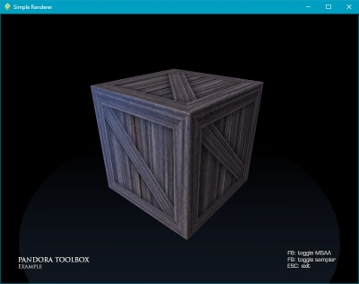

> [Features](../FEATURES.md) - | - [Cmake options](../README.md#cmake-options) - | - Project examples - | - [Changelog](../CHANGELOG.md) - | - [Issue reporting &amp; contribution](../CONTRIBUTING.md)

# Examples

* [Building projects](#building-projects)
    * [Generating project with Cmake](#generating-project-with-cmake)
    * [Cmake project hierarchy](#cmake-project-hierarchy)
    * [Library structure](#library-structure)
    * [Library docs](#library-docs)
* [Project examples](#project-examples)
    * Example 1 - Basic window
    * Example 2 - Simple renderer

---

## Building projects

### Generating project with Cmake

Different methods exist to generate the Cmake project. The section below is a summary of each method.
Step-by-step explanations are available here: [Windows](./build_steps_windows.txt) - [Linux/Unix/BSD](./build_steps_linux.txt).

#### Scripts

If Cmake is installed on your system (version >= 3.14), you can run a script from the *'_scripts'* directory (located in the toolbox root dir).
Choose the script for your IDE, then simply run it. To generate *'_examples'* projects,
you can simply copy the *'_scripts'* directory into the example project directory, then run the desired script.
You'll find the generated project in *'_build/<same_name_as_script_suffix>'* (ex: *'_build/vs2019-64'*).

Examples :
* *cmake_vs2017-32.bat*: Cmake generation for Visual Studio 2017 with 32-bit compilation.
* *cmake_vs2019-64.bat*: Cmake generation for Visual Studio 2019 with 64-bit compilation.
* *cmake_vs2019-64-win10*: Cmake generation for Visual Studio 2019 with 64-bit compilation, and optimized for Windows 10+ (higher feature levels, but not retro-compatible).

#### Cmake GUI

If Cmake is installed on your system (version >= 3.14), you can use *cmake-gui* to generate any Cmake project.
Open the *'CMakeLists.txt'* project file with it (either the one located in the toolbox root dir, or any *'_examples/<title>/CMakeLists.txt'*).
Then set some Cmake options (if you don't want the default values). See [list of Cmake options](../README.md#cmake-options).

Use the *Configure* button to create the project cache for a specific IDE (don't forget to set the "Optional platform" with the target architecture: 32/64-bit/ARM).
The *Generate* button then creates the project files for the selected IDE.
Finally, click the *Open project* button.

#### Cmake-compatible IDE

Some IDEs/editors (VSCode, CLion...) can directly open *'CMakeLists.txt'* files as projects.
Set the appropriate [Cmake options](../README.md#cmake-options) in them (if you don't want the default values).

### Cmake project hierarchy

The Pandora Toolbox project has its own Cmake framework (called CWork), to make Cmake management a lot easier.
This framework can also be used (or not) for parent projects with Pandora libs as dependencies.
[Various Cmake options](../README.md#cmake-options) are available for the Pandora libs (and for parent projects using CWork too).

Different approaches can be used to include the Pandora libs:
* Open the root *'CMakeLists.txt'* (located in the root directory of the toolbox) as a project solution.
  Compile it and install it locally, then include the locally installed libs in your own project.
  This may look like the best approach, but it's not convenient at all for open projects with online CIs and many contributors.
* Use the CWork framework for [your own project](./cmake/project.txt) too, and directly include the Pandora libs
  (either as [internal libs in the same solution](./cmake/direct_solution.txt), or preferably [as sub-solution libs](./cmake/parent_solution.txt) in a git submodule).
  All the CWork functions/macros that can be used are located and documented in *'_cmake/cwork.cmake'*. Other Cwork files contain internal mechanics.
  Note that extra module finders can be added in *'_cmake/modules'* to access external libraries (such as SDL, Qt, Nuklear...).
* Create an intermediate "sub-solution" Cmake file with CWork (to include Pandora libs as internal libs), then add it as a subdirectory in your own Cmake project.
  See the root toolbox *'CmakeLists.txt'* [file](../CMakeLists.txt) as an inspiration for your intermediate file (or use it, to include all libs).

### Library structure

Each Pandora library and example is structured the same way :
|  directory  |            content            |
|-------------|-------------------------------|
| include     | source code headers (*.h): those are the files to include in your project (they also contain docs/comments). |
| src         | source code implementation (*.cpp): private implementation of classes/modules exposed in *'include'*.|
| test        | unit tests for each testable class/module exposed in *'include'*.                                    |
| tools       | debugging tools, advanced test utilities or other related apps.                                      |
| shaders     | source code of shaders (*.hlsl/.vert/.frag): API-specific shaders for rendering (in examples).       |
| resources   | resource files: textures, sprites, icons, cursors... (in examples)                                   |

For each feature exposed in *'include'*, [check development status and compatibility here](../FEATURES.md).

Note: resource files are copied into the build directory at generation, and refreshed after each compilation.
If no compilation occurs (no C++ source changed), resources won't be refreshed!
To test resource files after changing them, you may need to change a C++ file (adding then removing a space does the trick).

Some common resources are shared by all libraries. They're located in the Pandora toolbox root directory :
|  directory  |            content            |
|-------------|-------------------------------|
| _cmake      | CWork files (Cmake framework) + Cmake module finders                                                 |
| _scripts    | Scripts for easy Cmake project generation (per IDE and platform).                                    |
| _libs       | external libraries: submodules (ex: gtest) and libraries downloaded by Cmake modules (glm, dxtk...). |
| _img        | images, icons and other resources: used for unit tests, tools, and readme files.                     |

### Library docs

Each feature is documented in the source code headers in the *'include'* directory of each library.
To discover the possibilities of a specific feature, the simplest approach is to take a look at the comments present in the header file.
It also provides a quick overview of the available methods, and also remarks/advices on how to use them efficiently.
However, this approach can be complex when you're not sure about which feature file to use.

It's useful to have a global reference to search for features.
For that purpose, docs can be generated in the form of web pages.
To generate docs:
* Doxygen must be installed on your system (it's available for free on most platforms).
* The Doxygen executable must be referenced in the PATH environment variable.
* When generating the project, the CWORK_DOCS cmake option must be ON (default: OFF).
* This option will create special targets in the IDE project, called <lib_name>.docs.
* Compiling those targets will generate the web pages (*'_docs/index.html'* in each lib).

---

## Project examples

A few examples are provided, to learn how to create simple windows and renderers with the Pandora libs.
They can also be used as boilerplate projects. They use the same structure as the Pandora libs:
* *'include'* (source code headers);
* *'src'* (source code implementation);
* *'shaders'* (source code of shaders, sorted per API).
* *'resources'* (textures, sprites, icons, cursors...).
* *'../_img'* (shared resources: app icon, cursors...).

After [generating the project with Cmake](#generating-project-with-cmake) (by copying *'_scripts'* or using GUI/IDE), the project can be open.
Before building anything, select the example project as active startup target:

The project can the be built, executed and debugged. Note that additional [Cmake options](../README.md#cmake-options) can be set.

### Example 1 - Basic window

> [Project files](./01_base_window)

A simple window, with homothety (when resized), and a background color that changes on click.
Good entry point to understand the window and event system.

### Example 2 - Simple renderer

> [Project files](./02_simple_renderer)

Simple 3D renderer, with third-person camera view rotating around a wooden box.
The window features mouse capture, simple geometry, sprites (title/commands), fixed lights, anti-aliasing, and a simple material management system.

Note: shaders are included as raw text files. Unfortunately, most IDEs fail at properly detecting shader models and types.
To avoid errors, shader management is disabled in the *'CmakeLists.txt'* file, with the line:

> set_source_files_properties(${_shaderFile} PROPERTIES VS_TOOL_OVERRIDE "None")

This line can be commented (*'#'*) to allow shader debugging/compilation.
However, the shader type and model will need to be configured in the IDE properties of EACH shader file.
They'll also need to be reconfigured everytime the project is regenerated (when the Cmake file changes).

To test shader files after modifying them, you can call the target *'build_shaders'* / *'deploy_shaders'*.
If a C++ file is recompiled, this will automatically trigger a call to the available targets.
The available target depends on the option **CWORK_SHADER_COMPILERS** (set at the top of the Cmake file):
* **ON**: enable shader compilation at runtime. Shader sources are only deployed (target *'deploy_shaders'*) and will be compiled during execution.
        This is the default value, because it doesn't require Python and makes things easier during development.
* **OFF**: disable compilation at runtime. Shader sources are pre-compiled (target *'build_shaders'*) and will just be read during execution.
         This is the best choice for production builds, but it requires Python 3.4+ and will fail if any of the shaders is invalid.

---

[Go to TOP](#examples)
